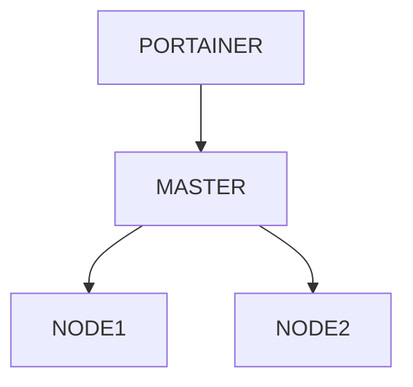
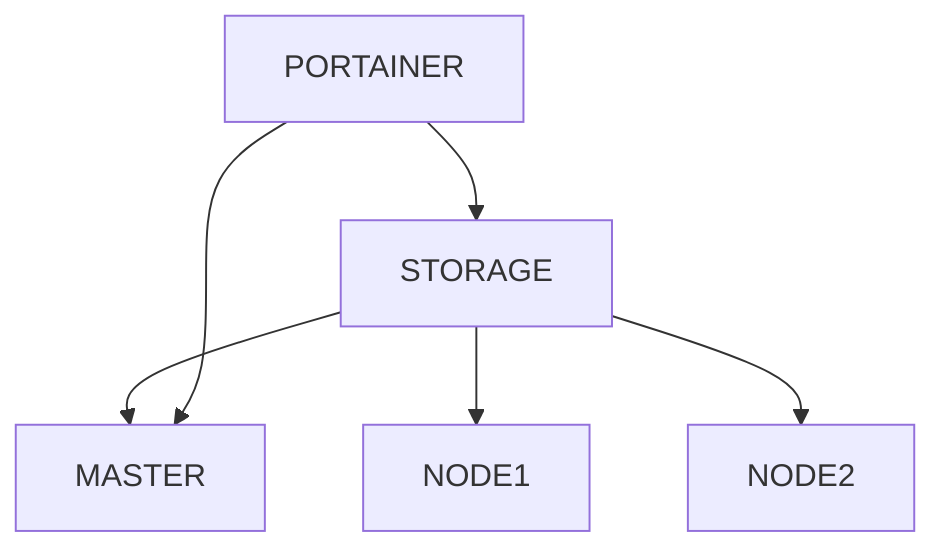

# swarm-station
Ambiente de Desenvolvimento e Testes de um cluster de swarm

Dedicado para o meu amigo Tonello

## Infraestrutura da implementação deste cluser


## Infraestrutura de armazenamento de dados dentro do cluster


## Procedimento de Instalação
### Comando para instalação do ambiente
```sh
vagrant up
```
## Storage de armazenamento dos cluster
dckstg: IP:192.168.56.20 /var/nfs/storage
Clientes: /nfs/storage

### Acesso ao ambiente de Gerenciamento do Cluster pelo Portainer
```sh
http://localhost:9000
```

## Preparação para o ambiente do jenkins
1º Passo: conecte no servidor master do swarm e execute o comando
```sh
vagrant ssh dckm01
cd /nfs/storage/ && mkdir jenkins_configuration
```
2º Passo
Dentro do potainer realize o deploy do stack

3º Acesse pela navegador a pagina web
```sh
http://localhost:8180
```