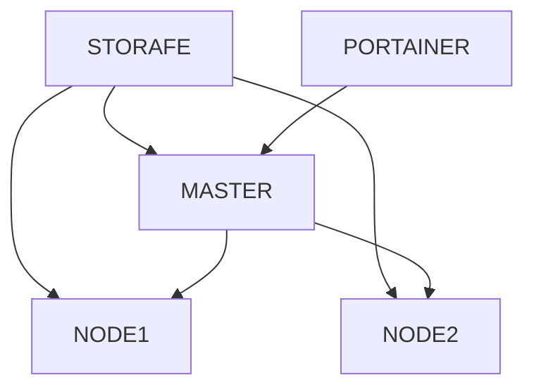

# swarm-station
Ambiente de Desenvolvimento e Testes de um cluster de swarm

Dedicado para o meu amigo Tonello

## Infraestrutura da implementação deste cluser


## Procedimento de Instalação
### Comando para instalação do ambiente
```sh
vagrant up
```
## Storage de armazenamento dos cluster
dckstg: IP:192.168.56.20 /var/nfs/storage
Clientes: /nfs/storage

### Acesso ao ambiente de Gerenciamento do Cluster pelo Portainer
```sh
http://localhost:9000
```

